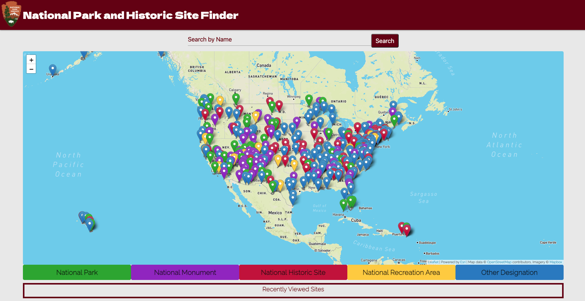
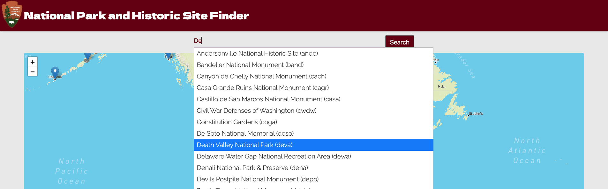
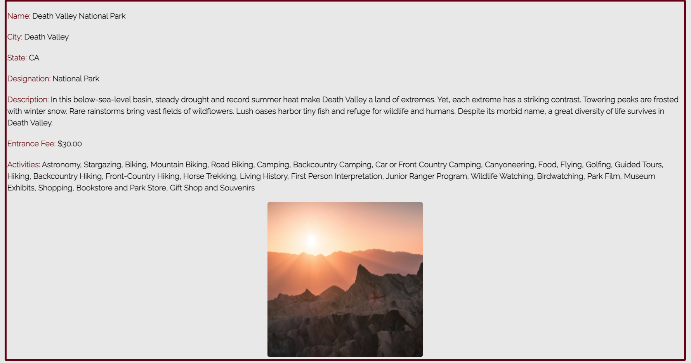
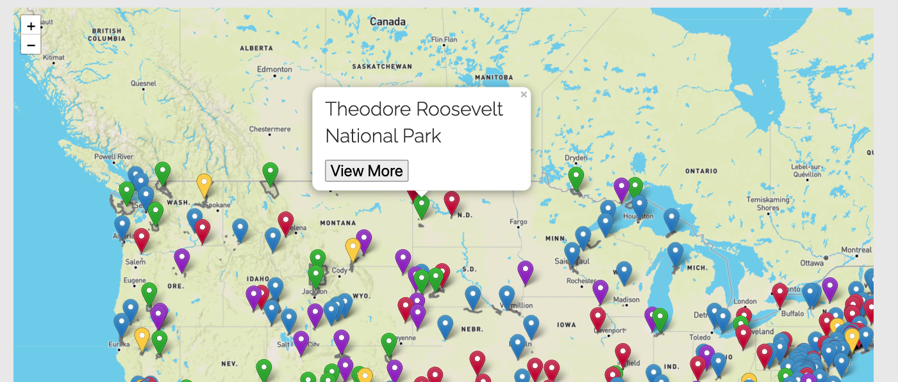
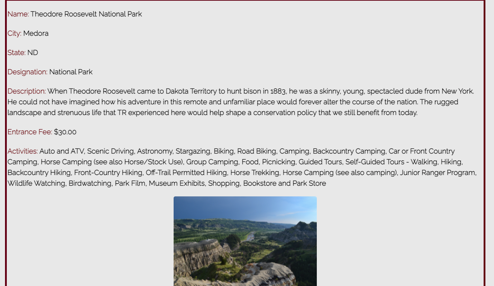

# Project1: National Park and Historic Site Finder #

Team Members: 
Dereje Ayele 
Casey Johnson 
Erich Purpur 
Alexander Vandenesse 

[Link to Website] (https://epurpur.github.io/Project1_NationalParkService/)

**** 
**** 
**** 
**** 
**** 
**** 

## User Story: 

AS A person interested in national parks and historic sites 
I WANT to access a polished mobile-first UI to easily search for historic sites and/or national parks either by location, or by name. 
SO THAT I can view information such as fees, activities, description, and designation - and view my last 5 saved searches. 

GIVEN I am using the National Park Finder to search for sites 
WHEN I open the site 
THEN I am presented with a map with pre-loaded plot points of 466 historic parks and sites 
WHEN I click on a plot point 
THEN I am presented with a button 'View More' 
WHEN I click 'View More'  
THEN the site is populated with the following fields: 
    --Name 
    --City, State 
    --Designation 
    --Description 
    --Entrance Fee 
    --Activites 
    -- + an image of the park

WHEN I search by specific park name by using the search bar 
THEN I am presented with a drop down auto-complete list of potential sites 
WHEN I click on a site 
THEN the site is populated with the following fields: 
    --Name 
    --City, State 
    --Designation 
    --Description 
    --Entrance Fee 
    --Activites 
    -- + an image of the park

WHEN I scroll to the end of the page 
THEN I am presented with my last 5 searches in clickable buttons 
WHEN I click the previously searched button displaying park name 
THEN the site is populated with the following fields: 
    --Name 
    --City, State 
    --Designation 
    --Description 
    --Entrance Fee 
    --Activites 
    -- + an image of the park

